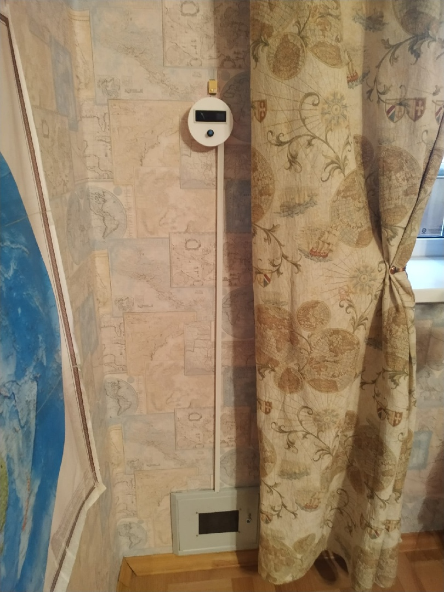

# $\mathbb{\color[RGB]{255,60,0}{Проект \ Бризер}}$

&emsp;&emsp;Название проекта, $\mathbb{\color[RGB]{252,193,83}{победившего}}$ в конкурсе "Поддержка научного и инженерного творчества старших классов" при $\mathbb{\color[RGB]{252,193,83}{правительстве \ Санкт-Петербурга}}$ 2021г. - "Проектирование, разработка и создание бризера в домашних условиях".\
&emsp;&emsp;[Ссылка на проект](Info/Проектирование%2C%20разработка%20и%20создание%20бризера%20в%20домашних%20условиях)

## $\mathbb{\color[RGB]{255,90,0}{Основная \ информация}}$

### $\mathbb{\color[RGB]{255,127,0}{Подробную \ информацию \ смотри \ в \ проекте}}$

&emsp;&emsp;[Ссылка на проект](Info/Проектирование%2C%20разработка%20и%20создание%20бризера%20в%20домашних%20условиях)

### $\mathbb{\color[RGB]{255,127,0}{Стек \ технологий \ разработки}}$

- $\mathbb{\color[RGB]{252,193,83}{C++}}$ --- прога для микроконтроллера(МК) Arduino NANO ($\mathbb{\color[RGB]{252,193,83}{ATmega328p}}$)
	+ Жёсткая и тщательная $\mathbb{\color[RGB]{252,193,83}{оптимизация \ кода}}$, чтобы он влез в память 32КБ Flash, 2КБ оперативной, 1КБ энергонезависимой EEPROM.
	+ $\mathbb{\color[RGB]{252,193,83}{WatchDog}}$.
	+ $\mathbb{\color[RGB]{252,193,83}{Прерывания}}$.
	+ Много $\mathbb{\color[RGB]{252,193,83}{шаблонов}}$.
	+ Много функций, мало ООП.
- $\mathbb{\color[RGB]{252,193,83}{С++}}$ --- прога для МК $\mathbb{\color[RGB]{252,193,83}{ESP8266}}$ (Tensilica’s L106)
	+ $\mathbb{\color[RGB]{252,193,83}{Сервер}}$ на С++.
	+ $\mathbb{\color[RGB]{252,193,83}{HTTP, \ FTP}}$ протоколы
	+ Общение с Arduino по $\mathbb{\color[RGB]{252,193,83}{UART(RX/TX)}}$ протоколу.
- HTML, CSS, SASS, JS, AJAX, web sockets --- сайт для бризера (новая версия ещё в производстве)
	+ Работа с $\mathbb{\color[RGB]{252,193,83}{CORS}}$ запросами.
- $\mathbb{\color[RGB]{252,193,83}{Схемотехника}}$
	+ Много проводов
	+ Учимся паять
	
### $\mathbb{\color[RGB]{255,127,0}{Среды \ разработки}}$

- Arduino IDE
- Visual Studio Code

### $\mathbb{\color[RGB]{255,127,0}{Фото}}$

### $\mathbb{\color[RGB]{255,127,0}{Адреса \ моих \ бризеров}}$

1. Бризер Романа <http://94.242.44.182:56567>
1. Бризер Borey <http://94.242.44.182:56568>

## $\mathbb{\color[RGB]{255,90,0}{Дата}}$

&emsp;&emsp;Изначально был код из начала 2019г. Полностью переписано заново к $\mathbb{\color[RGB]{252,193,83}{концу \ 2020г.}}$ Потом было ещё немного обновлений.

## $\mathbb{\color[RGB]{255,90,0}{Заключение}}$

 ${\color{yellow}TODO}$ 1) Новый сайт в затяжной стройке.
 